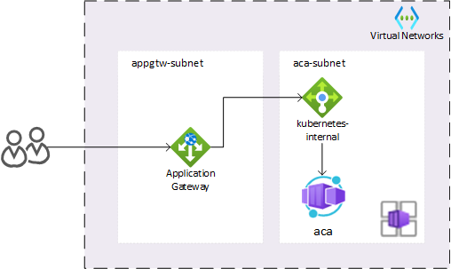
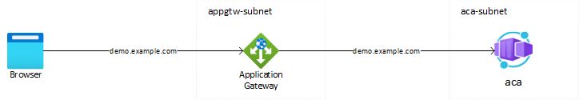

# Configure Azure Container Apps with Application Gateway (Default domain)

> **Note**
> This sample is part of the [Centralized inbound gateway options for Azure Container Apps - Configure ACA with Application Gateway (Terraform sample)](https://medium.com/@gjoshevski/centralized-inbound-gateway-options-for-azure-container-apps-aca-with-appgw-terraform-sample-95ce957284b9) blog post.

In this repo you can find an example of how to configure your Application Gateway and Azure Container apps using custom domain.

In this example the original host name will be preserved in the call between the reverse proxy (AppGw)and the back-end application server (ACA):

